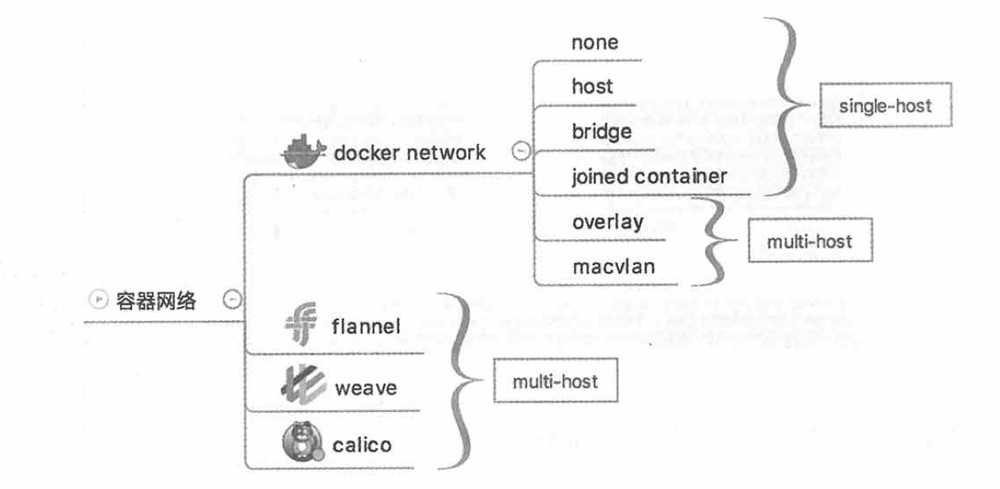

### 跨主机容器间通信方案

* docker原生overlay，macvlan
* 第三方flannel、weave、calico

> 那么多的技术方案和不断的新方案如何与docker集成？
答案：libnetwork和CNM(container network model)

CNM这个模型对容器网络进行了抽象

1. Sandbox
容器的网络栈，包含容器的interface、路由表和dns设置

2. Endpoint
作用是将Sandbox接入Network
一个Endpoint只能属于一个网络，也只能属于一个Sandbox

3. Network
包含一组Endpoint，同一Network的Endpoint可以直接通信

